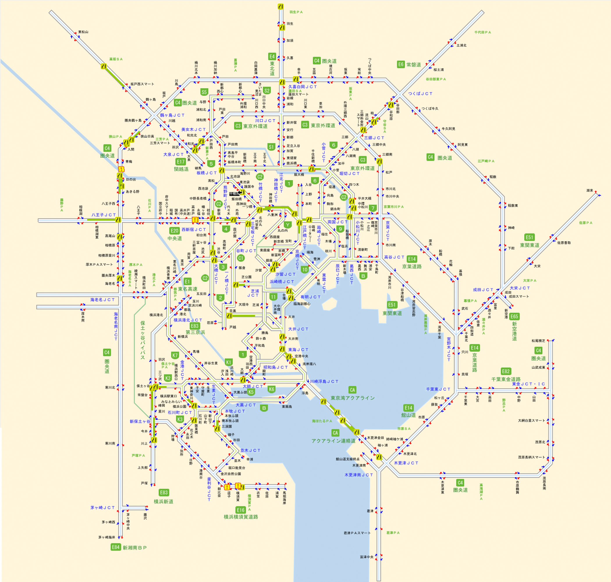

# 首都高
首都高速道路（首都高、しゅとこう） は、東京都を中心に 神奈川・埼玉・千葉 を結ぶ都市高速道路ネットワークであり、総延長は約 327.5km です。主に 環状線（C1・C2 など） と 放射線（1号線～10号線） で構成され、東京都心と周辺地域を高速で結ぶ重要な道路網です。

## 首都高速道路（赤）と接続する高速道路・有料道路（緑）の地図

## 首都高速道路の主要路線
### 環状線（環状道路）
|路線番号	|名称	|主な通過エリア	|距離|
|----------|--------|-------|-------|
|C1	|都心環状線	|銀座・丸の内・霞が関・神田・芝公園	|14.8km|
|C2	|中央環状線	|大井・大橋・西新宿・池袋・荒川・小菅・堀切	|52.5km|
|C3	|東京外環自動車道（外環道）	|大泉JCT～三郷JCT～市川	|約85km（一部未開通）|
|C4	|首都圏中央連絡自動車道（圏央道）	|茨城・埼玉・千葉・神奈川を結ぶ広域環状線	|約300km（一部未開通）|

 C1・C2・C3・C4 は、東京の異なる範囲をカバーする環状高速道路で、C1 が最も都心部に近く、C4 が最も外側にあります。

### 放射線（放射状に都心から延びる路線）
|路線番号	|名称	|主な通過エリア	|距離|
|----------|--------|-------|-------|
|1号線	|羽田線	|芝浦・羽田空港	|13.9km|
|2号線	|目黒線	|芝浦・目黒	|5.3km|
|3号線	|渋谷線	|渋谷・用賀・**E1 東名高速**	|11.2km|
|4号線	| 新宿線	|新宿・高井戸・**E20 中央自動車道**	|8.8km|
|5号線	| 池袋線	|池袋・板橋・**E4 東北自動車道**	|10.9km|
|6号線	|向島線	|両国・押上・千葉方面・**E6 常磐道**	|9.4km|
|7号線	|小松川線	|小松川・**E14 京葉道路**	|6.6km|
|9号線	|深川線	|江東区・湾岸エリア	|5.5km|
|10号線	|晴海線	|都心環状線・晴海（オリンピック選手村付近）	|1.5km（最短の路線）|

これらの路線は、東京都心と各主要高速道路（東名・中央・東北・京葉高速など）を結ぶ役割を果たします。

### 湾岸エリアを通る高速道路

|路線番号	|名称	|主な通過エリア	|距離|
|----------|--------|-------|-------|
|B	| 湾岸線 | 羽田空港・お台場・千葉 |40.5km|

湾岸線は東京湾沿いを走る高速道路で、羽田空港・千葉・東京港を結ぶ物流の重要なルートです。

## 道路交通情報
[公益財団法人日本道路交通情報センター](https://www.jartic.or.jp)

> ## 引用   
> https://commons.wikimedia.org/wiki/File:Tokyo_Metropolitan_Expressway_map-ja.svg
> https://www.shutoko.co.jp/company/database/route/